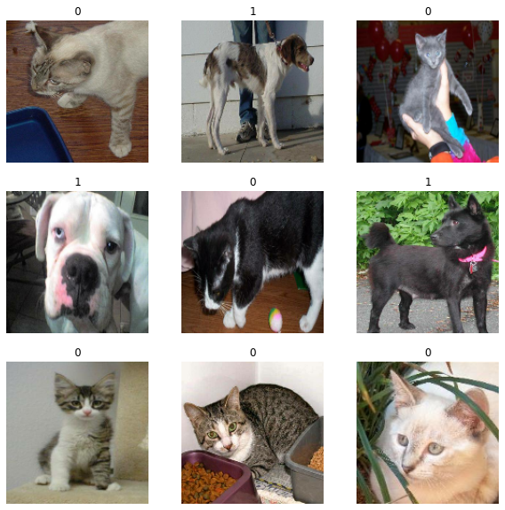
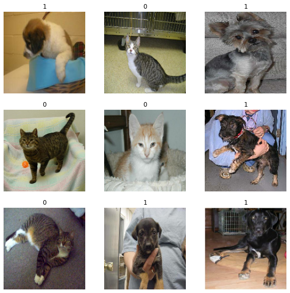
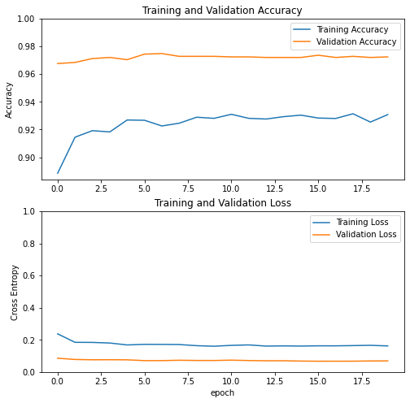
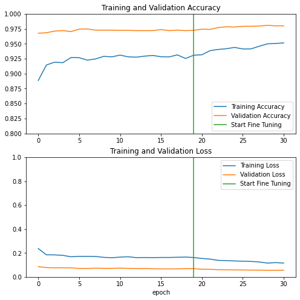

# Binary classification cats vs. dogs

* 50% of the cats vs. dogs data set with augmentation
* Transfer learning (Xception network) with fine-tuning
* Keras sequential API


```python
# This Python 3 environment comes with many helpful analytics libraries installed
# It is defined by the kaggle/python Docker image: https://github.com/kaggle/docker-python
# For example, here's several helpful packages to load

import numpy as np # linear algebra
import pandas as pd # data processing, CSV file I/O (e.g. pd.read_csv)

# Input data files are available in the read-only "../input/" directory
# For example, running this (by clicking run or pressing Shift+Enter) will list all files under the input directory

import os
#for dirname, _, filenames in os.walk('/kaggle/input'):
#    for filename in filenames:
#        print(os.path.join(dirname, filename))

# You can write up to 20GB to the current directory (/kaggle/working/) that gets preserved as output when you create a version using "Save & Run All" 
# You can also write temporary files to /kaggle/temp/, but they won't be saved outside of the current session
```


```python
import numpy as np
import pandas as pd
import matplotlib.pyplot as plt
import os
from tensorflow import keras
from tensorflow import data
```

# Directory structure

Make sure you have the following directory structure under /kaggle/input/:

* .../train_validate (a directory with images for training and validation)
    * .../cats (a sub-directory with 12500 cats images)
    * .../dogs (a sub-directory with 12500 dogs images)
* .../test_dir/test (a directory with 12500 unlabelled images for testing)

**It is important the test_dir fodler contains a single "unlabelled" folder with all the test images in it. This is because ```image_dataset_from_directory``` expects at least a single directory under the specified path.**


To obtain the directory structure as above, you can use the output of my notebook "cats-vs-dogs-train-val-test-data"

# Set image and model parameters

Set a few parameters used in the model:

* image_size to resize the images after they are read from disk, all images must have the same size
* batch_size to set the batch size
* validation_share = 0.25 and training_share = 0.75 to use 25% of the original train-validate data for training and 75% for validation (any other numbers like 0.1 and 0.4 are possible).
* set base learning rate to 0.001 


```python
image_size = (150,150)
batch_size = 16
validation_share = 0.1
training_share = 0.4
base_learning_rate = 0.001
```


<span style="color:blue"> 
**In tensorflow documentation, they take only 40% of images for training (it is also said that transfer learning performs better for smaller data sets) and 10% for validation and use data augmentation (horizontal flip).**
<span>
    
<span style="color:blue">     
**Why are we using the data augmentation then?  Why did not we use let's say 80% train-validate data (0.8* 25000 images) for training and 20% for validation (0.2* 25000 images) instead?** 
<span>

# Load images


In ```image_dataset_from_directory```, set

* ```validation_split = validation_share```  for validation dataset and ```validation_split = 1 - training_share``` for training dataset 
* the directory where the data are located
* ```labels = "inferred"``` to generate labels from the directory structure
* ```label_mode = 'binary'``` to encode the labels as scalars with values 0 and 1
* the explicit class names (which must match the names of the directories) to control the order of classes: ```class_names = ["cats", "dogs"]```
* ```color_mode = "rgb"```
* the batch size is ```batch_size``` for training and validation
* the batch size for testing is ```batch_size_testing```
* the size to resize the images after they read from disk, all images must have the same size
* ```shuffle = True``` for training and validation to shuffle the data and provide the ```seed``` argument to make sure there is no overlap between the training and validation datasets
* ```shuffle = False``` for testing data because we want to keep the datasets and their labels (filenames) ordered
* ```subset = "training"``` for training dataset and ```subset = "validation"``` for validation dataset
* ```label_mode = "binary"```  for training and validation
* ```label_mode = None``` for testing


```python
train_validate_directory = '/kaggle/input/cats-vs-dogs-train-val-test-data/train_validate/'

training_ds = keras.preprocessing.image_dataset_from_directory(
    train_validate_directory, 
    labels='inferred', 
    label_mode='binary', 
    class_names = ["cats","dogs"], 
    color_mode='rgb',
    batch_size=batch_size, 
    image_size=image_size, 
    shuffle=True,
    seed=1,
    validation_split = 1 - training_share,
    subset="training",
)
```

    Found 25000 files belonging to 2 classes.
    Using 10000 files for training.


```python
plt.figure(figsize=(10, 10))
for images, labels in training_ds.take(1):
    for i in range(9):
        ax = plt.subplot(3, 3, i + 1)
        plt.imshow(images[i].numpy().astype("uint8"))
        plt.title(int(labels[i]))
        plt.axis("off")
```





```python
train_validate_directory = '/kaggle/input/cats-vs-dogs-train-val-test-data/train_validate/'

validation_ds = keras.preprocessing.image_dataset_from_directory(
    train_validate_directory, 
    labels='inferred', 
    label_mode='binary', 
    class_names = ["cats","dogs"], 
    color_mode='rgb', 
    batch_size=batch_size, 
    image_size=image_size,
    shuffle=True,
    seed = 1,
    validation_split = validation_share,
    subset="validation"
)
```

    Found 25000 files belonging to 2 classes.
    Using 2500 files for validation.


```python
plt.figure(figsize=(10, 10))
for images, labels in validation_ds.take(1):
    for i in range(9):
        ax = plt.subplot(3, 3, i + 1)
        plt.imshow(images[i].numpy().astype("uint8"))
        plt.title(int(labels[i]))
        plt.axis("off")
```





**To return test images *along with their corresponding paths*, I use an overriden IMAGE_DATASET_FROM_DIRECTORY function from here** https://github.com/tensorflow/tensorflow/blob/v2.3.0/tensorflow/python/keras/preprocessing/image_dataset.py#L34-L206


```python
from __future__ import absolute_import
from __future__ import division
from __future__ import print_function

import numpy as np

from tensorflow.python.data.ops import dataset_ops
from tensorflow.python.keras.layers.preprocessing import image_preprocessing
from tensorflow.python.keras.preprocessing import dataset_utils
from tensorflow.python.ops import image_ops
from tensorflow.python.ops import io_ops
from tensorflow.python.util.tf_export import keras_export

WHITELIST_FORMATS = ('.bmp', '.gif', '.jpeg', '.jpg', '.png')

## Tensorflow override method to return fname as list as well as dataset

def my_image_dataset_from_directory(directory,
                                 labels='inferred',
                                 label_mode='int',
                                 class_names=None,
                                 color_mode='rgb',
                                 batch_size=32,
                                 image_size=(256, 256),
                                 shuffle=True,
                                 seed=None,
                                 validation_split=None,
                                 subset=None,
                                 interpolation='bilinear',
                                 follow_links=False):
  
  if labels != 'inferred':
    if not isinstance(labels, (list, tuple)):
      raise ValueError(
          '`labels` argument should be a list/tuple of integer labels, of '
          'the same size as the number of image files in the target '
          'directory. If you wish to infer the labels from the subdirectory '
          'names in the target directory, pass `labels="inferred"`. '
          'If you wish to get a dataset that only contains images '
          '(no labels), pass `label_mode=None`.')
    if class_names:
      raise ValueError('You can only pass `class_names` if the labels are '
                       'inferred from the subdirectory names in the target '
                       'directory (`labels="inferred"`).')
  if label_mode not in {'int', 'categorical', 'binary', None}:
    raise ValueError(
        '`label_mode` argument must be one of "int", "categorical", "binary", '
        'or None. Received: %s' % (label_mode,))
  if color_mode == 'rgb':
    num_channels = 3
  elif color_mode == 'rgba':
    num_channels = 4
  elif color_mode == 'grayscale':
    num_channels = 1
  else:
    raise ValueError(
        '`color_mode` must be one of {"rbg", "rgba", "grayscale"}. '
        'Received: %s' % (color_mode,))
  interpolation = image_preprocessing.get_interpolation(interpolation)
  dataset_utils.check_validation_split_arg(
      validation_split, subset, shuffle, seed)

  if seed is None:
    seed = np.random.randint(1e6)
  image_paths, labels, class_names = dataset_utils.index_directory(
      directory,
      labels,
      formats=WHITELIST_FORMATS,
      class_names=class_names,
      shuffle=shuffle,
      seed=seed,
      follow_links=follow_links)

  if label_mode == 'binary' and len(class_names) != 2:
    raise ValueError(
        'When passing `label_mode="binary", there must exactly 2 classes. '
        'Found the following classes: %s' % (class_names,))

  image_paths, labels = dataset_utils.get_training_or_validation_split(
      image_paths, labels, validation_split, subset)

  dataset = paths_and_labels_to_dataset(
      image_paths=image_paths,
      image_size=image_size,
      num_channels=num_channels,
      labels=labels,
      label_mode=label_mode,
      num_classes=len(class_names),
      interpolation=interpolation)
  if shuffle:
    # Shuffle locally at each iteration
    dataset = dataset.shuffle(buffer_size=batch_size * 8, seed=seed)
  dataset = dataset.batch(batch_size)
  # Users may need to reference `class_names`.
  dataset.class_names = class_names
  return dataset, image_paths

def paths_and_labels_to_dataset(image_paths,
                                image_size,
                                num_channels,
                                labels,
                                label_mode,
                                num_classes,
                                interpolation):
  """Constructs a dataset of images and labels."""
  # TODO(fchollet): consider making num_parallel_calls settable
  path_ds = dataset_ops.Dataset.from_tensor_slices(image_paths)
  img_ds = path_ds.map(
      lambda x: path_to_image(x, image_size, num_channels, interpolation))
  if label_mode:
    label_ds = dataset_utils.labels_to_dataset(labels, label_mode, num_classes)
    img_ds = dataset_ops.Dataset.zip((img_ds, label_ds))
  return img_ds


def path_to_image(path, image_size, num_channels, interpolation):
  img = io_ops.read_file(path)
  img = image_ops.decode_image(
      img, channels=num_channels, expand_animations=False)
  img = image_ops.resize_images_v2(img, image_size, method=interpolation)
  img.set_shape((image_size[0], image_size[1], num_channels))
  return img
```

Use 100% of the original test data (12500 images) for testing.

* set ```label_mode=None``` and ```batch_size=1```


```python
testing_directory = '/kaggle/input/cats-vs-dogs-train-val-test-data/test_dir/'

#testing_ds = keras.preprocessing.image_dataset_from_directory(
testing_ds, testing_paths = my_image_dataset_from_directory(
    testing_directory, 
    label_mode=None, 
    color_mode='rgb', 
    batch_size=12500,
    image_size=image_size, 
    shuffle=False,
    seed = 1,
)
```

    Found 12500 files belonging to 1 classes.


Print the number of batches


```python
print("Number of training batches: %d" % data.experimental.cardinality(training_ds))
print("Number of validation batches: %d" % data.experimental.cardinality(validation_ds))
print("Number of test batches: %d" % data.experimental.cardinality(testing_ds))
```

    Number of training batches: 625
    Number of validation batches: 157
    Number of test batches: 1


# Standardize the data

We need to normalize and rescale (intensity levels of) images. We will do this as part of the model.

## Resize the images

* One could resize the images as following:

```
size = (150, 150)

train_ds = train_ds.map(lambda x, y: (tf.image.resize(x, size), y))
validation_ds = validation_ds.map(lambda x, y: (tf.image.resize(x, size), y))
test_ds = test_ds.map(lambda x, y: (tf.image.resize(x, size), y))
```

* Here we do this with ```tf.keras.layers.experimental.preprocessing.Resizing``` as part of the model

## Normalize pixel values

* To rescale an input in the [0, 255] range to be in the [-1, 1] range, we use 
```tf.keras.layers.experimental.preprocessing.Rescaling(scale = 1./127.5, offset = -1)``` as part of the model.


<span style="color:blue"> **From tensorflow documentation. Note: If using other tf.keras.applications, be sure to check the API doc to determine if they expect pixels in [-1,1] or [0,1], or use the included preprocess_input function.**</span>.


```python
data_standardization = keras.Sequential([
        keras.layers.experimental.preprocessing.Resizing(image_size[0], image_size[1], interpolation='bilinear'),
        keras.layers.experimental.preprocessing.Rescaling(scale = 1./127.5, offset = -1)
])
    
```

## **Cache and prefetch the data to optimize loading speed**

From the tensorflow documentation:

* Caching saves some operations (like file opening and data reading) from being executed during each epoch.

* Prefetching overlaps the preprocessing and model execution of a training step. While the model is executing training step s, the input pipeline is reading the data for step s+1. Doing so reduces the step time to the maximum (as opposed to the sum) of the training and the time it takes to extract the data.

* Most dataset input pipelines should end with a call to prefetch. This allows later elements to be prepared while the current element is being processed. This often improves latency and throughput, at the cost of using additional memory to store prefetched elements.

* The number of elements to prefetch should be equal to (or possibly greater than) the number of batches consumed by a single training step. You could either manually tune this value, or set it to tf.data.experimental.AUTOTUNE which will prompt the tf.data runtime to tune the value dynamically at runtime.

* Note: Like other Dataset methods, prefetch operates on the elements of the input dataset. It has no concept of examples vs. batches. examples.prefetch(2) will prefetch two elements (2 examples), while examples.batch(20).prefetch(2) will prefetch 2 elements (2 batches, of 20 examples each).


```python
training_ds = training_ds.cache().prefetch(data.experimental.AUTOTUNE)
validation_ds = validation_ds.cache().prefetch(data.experimental.AUTOTUNE)
testing_ds = testing_ds.cache().prefetch(data.experimental.AUTOTUNE)
```

# Data augmentation


```python
from tensorflow import keras
from tensorflow.keras import layers

data_augmentation = keras.Sequential([
        layers.experimental.preprocessing.RandomRotation(0.125),
        layers.experimental.preprocessing.RandomWidth(0.1),
        layers.experimental.preprocessing.RandomHeight(0.1),
        layers.experimental.preprocessing.RandomZoom(-0.1),
        layers.experimental.preprocessing.RandomTranslation(width_factor=0.1, height_factor=0.1),
        layers.experimental.preprocessing.RandomFlip("horizontal")
])
```

**Somehow, adding all trasformations worsens the performance.**

# Build a model

* Use Xception model as a base model
* Set weights to ```imagenet```
* Do not include the fully-connected layer at the top of the network
* Freeze the model

*From tensorflow documentation:*

*The very last classification layer (on "top", as most diagrams of machine learning models go from bottom to top) is not very useful. Instead, you will follow the common practice to depend on the very last layer before the flatten operation. This layer is called the "bottleneck layer". The bottleneck layer features retain more generality as compared to the final/top layer.*


```python
base_model = keras.applications.Xception(
    weights="imagenet",
    input_shape=(image_size[0], image_size[1], 3),
    include_top=False,
)

base_model.trainable = False

# Let's take a look at the base model architecture
base_model.summary()
```

    Model: "xception"
    __________________________________________________________________________________________________
    Layer (type)                    Output Shape         Param #     Connected to                     
    ==================================================================================================
    input_1 (InputLayer)            [(None, 150, 150, 3) 0                                            
    __________________________________________________________________________________________________
    block1_conv1 (Conv2D)           (None, 74, 74, 32)   864         input_1[0][0]                    
    __________________________________________________________________________________________________
    block1_conv1_bn (BatchNormaliza (None, 74, 74, 32)   128         block1_conv1[0][0]               
    __________________________________________________________________________________________________
    block1_conv1_act (Activation)   (None, 74, 74, 32)   0           block1_conv1_bn[0][0]            
    __________________________________________________________________________________________________
    block1_conv2 (Conv2D)           (None, 72, 72, 64)   18432       block1_conv1_act[0][0]           
    __________________________________________________________________________________________________
    block1_conv2_bn (BatchNormaliza (None, 72, 72, 64)   256         block1_conv2[0][0]               
    __________________________________________________________________________________________________
    block1_conv2_act (Activation)   (None, 72, 72, 64)   0           block1_conv2_bn[0][0]            
    __________________________________________________________________________________________________
    block2_sepconv1 (SeparableConv2 (None, 72, 72, 128)  8768        block1_conv2_act[0][0]           
    __________________________________________________________________________________________________
    block2_sepconv1_bn (BatchNormal (None, 72, 72, 128)  512         block2_sepconv1[0][0]            
    __________________________________________________________________________________________________
    block2_sepconv2_act (Activation (None, 72, 72, 128)  0           block2_sepconv1_bn[0][0]         
    __________________________________________________________________________________________________
    block2_sepconv2 (SeparableConv2 (None, 72, 72, 128)  17536       block2_sepconv2_act[0][0]        
    __________________________________________________________________________________________________
    block2_sepconv2_bn (BatchNormal (None, 72, 72, 128)  512         block2_sepconv2[0][0]            
    __________________________________________________________________________________________________
    conv2d (Conv2D)                 (None, 36, 36, 128)  8192        block1_conv2_act[0][0]           
    __________________________________________________________________________________________________
    block2_pool (MaxPooling2D)      (None, 36, 36, 128)  0           block2_sepconv2_bn[0][0]         
    __________________________________________________________________________________________________
    batch_normalization (BatchNorma (None, 36, 36, 128)  512         conv2d[0][0]                     
    __________________________________________________________________________________________________
    add (Add)                       (None, 36, 36, 128)  0           block2_pool[0][0]                
                                                                     batch_normalization[0][0]        
    __________________________________________________________________________________________________
    block3_sepconv1_act (Activation (None, 36, 36, 128)  0           add[0][0]                        
    __________________________________________________________________________________________________
    block3_sepconv1 (SeparableConv2 (None, 36, 36, 256)  33920       block3_sepconv1_act[0][0]        
    __________________________________________________________________________________________________
    block3_sepconv1_bn (BatchNormal (None, 36, 36, 256)  1024        block3_sepconv1[0][0]            
    __________________________________________________________________________________________________
    block3_sepconv2_act (Activation (None, 36, 36, 256)  0           block3_sepconv1_bn[0][0]         
    __________________________________________________________________________________________________
    block3_sepconv2 (SeparableConv2 (None, 36, 36, 256)  67840       block3_sepconv2_act[0][0]        
    __________________________________________________________________________________________________
    block3_sepconv2_bn (BatchNormal (None, 36, 36, 256)  1024        block3_sepconv2[0][0]            
    __________________________________________________________________________________________________
    conv2d_1 (Conv2D)               (None, 18, 18, 256)  32768       add[0][0]                        
    __________________________________________________________________________________________________
    block3_pool (MaxPooling2D)      (None, 18, 18, 256)  0           block3_sepconv2_bn[0][0]         
    __________________________________________________________________________________________________
    batch_normalization_1 (BatchNor (None, 18, 18, 256)  1024        conv2d_1[0][0]                   
    __________________________________________________________________________________________________
    add_1 (Add)                     (None, 18, 18, 256)  0           block3_pool[0][0]                
                                                                     batch_normalization_1[0][0]      
    __________________________________________________________________________________________________
    block4_sepconv1_act (Activation (None, 18, 18, 256)  0           add_1[0][0]                      
    __________________________________________________________________________________________________
    block4_sepconv1 (SeparableConv2 (None, 18, 18, 728)  188672      block4_sepconv1_act[0][0]        
    __________________________________________________________________________________________________
    block4_sepconv1_bn (BatchNormal (None, 18, 18, 728)  2912        block4_sepconv1[0][0]            
    __________________________________________________________________________________________________
    block4_sepconv2_act (Activation (None, 18, 18, 728)  0           block4_sepconv1_bn[0][0]         
    __________________________________________________________________________________________________
    block4_sepconv2 (SeparableConv2 (None, 18, 18, 728)  536536      block4_sepconv2_act[0][0]        
    __________________________________________________________________________________________________
    block4_sepconv2_bn (BatchNormal (None, 18, 18, 728)  2912        block4_sepconv2[0][0]            
    __________________________________________________________________________________________________
    conv2d_2 (Conv2D)               (None, 9, 9, 728)    186368      add_1[0][0]                      
    __________________________________________________________________________________________________
    block4_pool (MaxPooling2D)      (None, 9, 9, 728)    0           block4_sepconv2_bn[0][0]         
    __________________________________________________________________________________________________
    batch_normalization_2 (BatchNor (None, 9, 9, 728)    2912        conv2d_2[0][0]                   
    __________________________________________________________________________________________________
    add_2 (Add)                     (None, 9, 9, 728)    0           block4_pool[0][0]                
                                                                     batch_normalization_2[0][0]      
    __________________________________________________________________________________________________
    block5_sepconv1_act (Activation (None, 9, 9, 728)    0           add_2[0][0]                      
    __________________________________________________________________________________________________
    block5_sepconv1 (SeparableConv2 (None, 9, 9, 728)    536536      block5_sepconv1_act[0][0]        
    __________________________________________________________________________________________________
    block5_sepconv1_bn (BatchNormal (None, 9, 9, 728)    2912        block5_sepconv1[0][0]            
    __________________________________________________________________________________________________
    block5_sepconv2_act (Activation (None, 9, 9, 728)    0           block5_sepconv1_bn[0][0]         
    __________________________________________________________________________________________________
    block5_sepconv2 (SeparableConv2 (None, 9, 9, 728)    536536      block5_sepconv2_act[0][0]        
    __________________________________________________________________________________________________
    block5_sepconv2_bn (BatchNormal (None, 9, 9, 728)    2912        block5_sepconv2[0][0]            
    __________________________________________________________________________________________________
    block5_sepconv3_act (Activation (None, 9, 9, 728)    0           block5_sepconv2_bn[0][0]         
    __________________________________________________________________________________________________
    block5_sepconv3 (SeparableConv2 (None, 9, 9, 728)    536536      block5_sepconv3_act[0][0]        
    __________________________________________________________________________________________________
    block5_sepconv3_bn (BatchNormal (None, 9, 9, 728)    2912        block5_sepconv3[0][0]            
    __________________________________________________________________________________________________
    add_3 (Add)                     (None, 9, 9, 728)    0           block5_sepconv3_bn[0][0]         
                                                                     add_2[0][0]                      
    __________________________________________________________________________________________________
    block6_sepconv1_act (Activation (None, 9, 9, 728)    0           add_3[0][0]                      
    __________________________________________________________________________________________________
    block6_sepconv1 (SeparableConv2 (None, 9, 9, 728)    536536      block6_sepconv1_act[0][0]        
    __________________________________________________________________________________________________
    block6_sepconv1_bn (BatchNormal (None, 9, 9, 728)    2912        block6_sepconv1[0][0]            
    __________________________________________________________________________________________________
    block6_sepconv2_act (Activation (None, 9, 9, 728)    0           block6_sepconv1_bn[0][0]         
    __________________________________________________________________________________________________
    block6_sepconv2 (SeparableConv2 (None, 9, 9, 728)    536536      block6_sepconv2_act[0][0]        
    __________________________________________________________________________________________________
    block6_sepconv2_bn (BatchNormal (None, 9, 9, 728)    2912        block6_sepconv2[0][0]            
    __________________________________________________________________________________________________
    block6_sepconv3_act (Activation (None, 9, 9, 728)    0           block6_sepconv2_bn[0][0]         
    __________________________________________________________________________________________________
    block6_sepconv3 (SeparableConv2 (None, 9, 9, 728)    536536      block6_sepconv3_act[0][0]        
    __________________________________________________________________________________________________
    block6_sepconv3_bn (BatchNormal (None, 9, 9, 728)    2912        block6_sepconv3[0][0]            
    __________________________________________________________________________________________________
    add_4 (Add)                     (None, 9, 9, 728)    0           block6_sepconv3_bn[0][0]         
                                                                     add_3[0][0]                      
    __________________________________________________________________________________________________
    block7_sepconv1_act (Activation (None, 9, 9, 728)    0           add_4[0][0]                      
    __________________________________________________________________________________________________
    block7_sepconv1 (SeparableConv2 (None, 9, 9, 728)    536536      block7_sepconv1_act[0][0]        
    __________________________________________________________________________________________________
    block7_sepconv1_bn (BatchNormal (None, 9, 9, 728)    2912        block7_sepconv1[0][0]            
    __________________________________________________________________________________________________
    block7_sepconv2_act (Activation (None, 9, 9, 728)    0           block7_sepconv1_bn[0][0]         
    __________________________________________________________________________________________________
    block7_sepconv2 (SeparableConv2 (None, 9, 9, 728)    536536      block7_sepconv2_act[0][0]        
    __________________________________________________________________________________________________
    block7_sepconv2_bn (BatchNormal (None, 9, 9, 728)    2912        block7_sepconv2[0][0]            
    __________________________________________________________________________________________________
    block7_sepconv3_act (Activation (None, 9, 9, 728)    0           block7_sepconv2_bn[0][0]         
    __________________________________________________________________________________________________
    block7_sepconv3 (SeparableConv2 (None, 9, 9, 728)    536536      block7_sepconv3_act[0][0]        
    __________________________________________________________________________________________________
    block7_sepconv3_bn (BatchNormal (None, 9, 9, 728)    2912        block7_sepconv3[0][0]            
    __________________________________________________________________________________________________
    add_5 (Add)                     (None, 9, 9, 728)    0           block7_sepconv3_bn[0][0]         
                                                                     add_4[0][0]                      
    __________________________________________________________________________________________________
    block8_sepconv1_act (Activation (None, 9, 9, 728)    0           add_5[0][0]                      
    __________________________________________________________________________________________________
    block8_sepconv1 (SeparableConv2 (None, 9, 9, 728)    536536      block8_sepconv1_act[0][0]        
    __________________________________________________________________________________________________
    block8_sepconv1_bn (BatchNormal (None, 9, 9, 728)    2912        block8_sepconv1[0][0]            
    __________________________________________________________________________________________________
    block8_sepconv2_act (Activation (None, 9, 9, 728)    0           block8_sepconv1_bn[0][0]         
    __________________________________________________________________________________________________
    block8_sepconv2 (SeparableConv2 (None, 9, 9, 728)    536536      block8_sepconv2_act[0][0]        
    __________________________________________________________________________________________________
    block8_sepconv2_bn (BatchNormal (None, 9, 9, 728)    2912        block8_sepconv2[0][0]            
    __________________________________________________________________________________________________
    block8_sepconv3_act (Activation (None, 9, 9, 728)    0           block8_sepconv2_bn[0][0]         
    __________________________________________________________________________________________________
    block8_sepconv3 (SeparableConv2 (None, 9, 9, 728)    536536      block8_sepconv3_act[0][0]        
    __________________________________________________________________________________________________
    block8_sepconv3_bn (BatchNormal (None, 9, 9, 728)    2912        block8_sepconv3[0][0]            
    __________________________________________________________________________________________________
    add_6 (Add)                     (None, 9, 9, 728)    0           block8_sepconv3_bn[0][0]         
                                                                     add_5[0][0]                      
    __________________________________________________________________________________________________
    block9_sepconv1_act (Activation (None, 9, 9, 728)    0           add_6[0][0]                      
    __________________________________________________________________________________________________
    block9_sepconv1 (SeparableConv2 (None, 9, 9, 728)    536536      block9_sepconv1_act[0][0]        
    __________________________________________________________________________________________________
    block9_sepconv1_bn (BatchNormal (None, 9, 9, 728)    2912        block9_sepconv1[0][0]            
    __________________________________________________________________________________________________
    block9_sepconv2_act (Activation (None, 9, 9, 728)    0           block9_sepconv1_bn[0][0]         
    __________________________________________________________________________________________________
    block9_sepconv2 (SeparableConv2 (None, 9, 9, 728)    536536      block9_sepconv2_act[0][0]        
    __________________________________________________________________________________________________
    block9_sepconv2_bn (BatchNormal (None, 9, 9, 728)    2912        block9_sepconv2[0][0]            
    __________________________________________________________________________________________________
    block9_sepconv3_act (Activation (None, 9, 9, 728)    0           block9_sepconv2_bn[0][0]         
    __________________________________________________________________________________________________
    block9_sepconv3 (SeparableConv2 (None, 9, 9, 728)    536536      block9_sepconv3_act[0][0]        
    __________________________________________________________________________________________________
    block9_sepconv3_bn (BatchNormal (None, 9, 9, 728)    2912        block9_sepconv3[0][0]            
    __________________________________________________________________________________________________
    add_7 (Add)                     (None, 9, 9, 728)    0           block9_sepconv3_bn[0][0]         
                                                                     add_6[0][0]                      
    __________________________________________________________________________________________________
    block10_sepconv1_act (Activatio (None, 9, 9, 728)    0           add_7[0][0]                      
    __________________________________________________________________________________________________
    block10_sepconv1 (SeparableConv (None, 9, 9, 728)    536536      block10_sepconv1_act[0][0]       
    __________________________________________________________________________________________________
    block10_sepconv1_bn (BatchNorma (None, 9, 9, 728)    2912        block10_sepconv1[0][0]           
    __________________________________________________________________________________________________
    block10_sepconv2_act (Activatio (None, 9, 9, 728)    0           block10_sepconv1_bn[0][0]        
    __________________________________________________________________________________________________
    block10_sepconv2 (SeparableConv (None, 9, 9, 728)    536536      block10_sepconv2_act[0][0]       
    __________________________________________________________________________________________________
    block10_sepconv2_bn (BatchNorma (None, 9, 9, 728)    2912        block10_sepconv2[0][0]           
    __________________________________________________________________________________________________
    block10_sepconv3_act (Activatio (None, 9, 9, 728)    0           block10_sepconv2_bn[0][0]        
    __________________________________________________________________________________________________
    block10_sepconv3 (SeparableConv (None, 9, 9, 728)    536536      block10_sepconv3_act[0][0]       
    __________________________________________________________________________________________________
    block10_sepconv3_bn (BatchNorma (None, 9, 9, 728)    2912        block10_sepconv3[0][0]           
    __________________________________________________________________________________________________
    add_8 (Add)                     (None, 9, 9, 728)    0           block10_sepconv3_bn[0][0]        
                                                                     add_7[0][0]                      
    __________________________________________________________________________________________________
    block11_sepconv1_act (Activatio (None, 9, 9, 728)    0           add_8[0][0]                      
    __________________________________________________________________________________________________
    block11_sepconv1 (SeparableConv (None, 9, 9, 728)    536536      block11_sepconv1_act[0][0]       
    __________________________________________________________________________________________________
    block11_sepconv1_bn (BatchNorma (None, 9, 9, 728)    2912        block11_sepconv1[0][0]           
    __________________________________________________________________________________________________
    block11_sepconv2_act (Activatio (None, 9, 9, 728)    0           block11_sepconv1_bn[0][0]        
    __________________________________________________________________________________________________
    block11_sepconv2 (SeparableConv (None, 9, 9, 728)    536536      block11_sepconv2_act[0][0]       
    __________________________________________________________________________________________________
    block11_sepconv2_bn (BatchNorma (None, 9, 9, 728)    2912        block11_sepconv2[0][0]           
    __________________________________________________________________________________________________
    block11_sepconv3_act (Activatio (None, 9, 9, 728)    0           block11_sepconv2_bn[0][0]        
    __________________________________________________________________________________________________
    block11_sepconv3 (SeparableConv (None, 9, 9, 728)    536536      block11_sepconv3_act[0][0]       
    __________________________________________________________________________________________________
    block11_sepconv3_bn (BatchNorma (None, 9, 9, 728)    2912        block11_sepconv3[0][0]           
    __________________________________________________________________________________________________
    add_9 (Add)                     (None, 9, 9, 728)    0           block11_sepconv3_bn[0][0]        
                                                                     add_8[0][0]                      
    __________________________________________________________________________________________________
    block12_sepconv1_act (Activatio (None, 9, 9, 728)    0           add_9[0][0]                      
    __________________________________________________________________________________________________
    block12_sepconv1 (SeparableConv (None, 9, 9, 728)    536536      block12_sepconv1_act[0][0]       
    __________________________________________________________________________________________________
    block12_sepconv1_bn (BatchNorma (None, 9, 9, 728)    2912        block12_sepconv1[0][0]           
    __________________________________________________________________________________________________
    block12_sepconv2_act (Activatio (None, 9, 9, 728)    0           block12_sepconv1_bn[0][0]        
    __________________________________________________________________________________________________
    block12_sepconv2 (SeparableConv (None, 9, 9, 728)    536536      block12_sepconv2_act[0][0]       
    __________________________________________________________________________________________________
    block12_sepconv2_bn (BatchNorma (None, 9, 9, 728)    2912        block12_sepconv2[0][0]           
    __________________________________________________________________________________________________
    block12_sepconv3_act (Activatio (None, 9, 9, 728)    0           block12_sepconv2_bn[0][0]        
    __________________________________________________________________________________________________
    block12_sepconv3 (SeparableConv (None, 9, 9, 728)    536536      block12_sepconv3_act[0][0]       
    __________________________________________________________________________________________________
    block12_sepconv3_bn (BatchNorma (None, 9, 9, 728)    2912        block12_sepconv3[0][0]           
    __________________________________________________________________________________________________
    add_10 (Add)                    (None, 9, 9, 728)    0           block12_sepconv3_bn[0][0]        
                                                                     add_9[0][0]                      
    __________________________________________________________________________________________________
    block13_sepconv1_act (Activatio (None, 9, 9, 728)    0           add_10[0][0]                     
    __________________________________________________________________________________________________
    block13_sepconv1 (SeparableConv (None, 9, 9, 728)    536536      block13_sepconv1_act[0][0]       
    __________________________________________________________________________________________________
    block13_sepconv1_bn (BatchNorma (None, 9, 9, 728)    2912        block13_sepconv1[0][0]           
    __________________________________________________________________________________________________
    block13_sepconv2_act (Activatio (None, 9, 9, 728)    0           block13_sepconv1_bn[0][0]        
    __________________________________________________________________________________________________
    block13_sepconv2 (SeparableConv (None, 9, 9, 1024)   752024      block13_sepconv2_act[0][0]       
    __________________________________________________________________________________________________
    block13_sepconv2_bn (BatchNorma (None, 9, 9, 1024)   4096        block13_sepconv2[0][0]           
    __________________________________________________________________________________________________
    conv2d_3 (Conv2D)               (None, 5, 5, 1024)   745472      add_10[0][0]                     
    __________________________________________________________________________________________________
    block13_pool (MaxPooling2D)     (None, 5, 5, 1024)   0           block13_sepconv2_bn[0][0]        
    __________________________________________________________________________________________________
    batch_normalization_3 (BatchNor (None, 5, 5, 1024)   4096        conv2d_3[0][0]                   
    __________________________________________________________________________________________________
    add_11 (Add)                    (None, 5, 5, 1024)   0           block13_pool[0][0]               
                                                                     batch_normalization_3[0][0]      
    __________________________________________________________________________________________________
    block14_sepconv1 (SeparableConv (None, 5, 5, 1536)   1582080     add_11[0][0]                     
    __________________________________________________________________________________________________
    block14_sepconv1_bn (BatchNorma (None, 5, 5, 1536)   6144        block14_sepconv1[0][0]           
    __________________________________________________________________________________________________
    block14_sepconv1_act (Activatio (None, 5, 5, 1536)   0           block14_sepconv1_bn[0][0]        
    __________________________________________________________________________________________________
    block14_sepconv2 (SeparableConv (None, 5, 5, 2048)   3159552     block14_sepconv1_act[0][0]       
    __________________________________________________________________________________________________
    block14_sepconv2_bn (BatchNorma (None, 5, 5, 2048)   8192        block14_sepconv2[0][0]           
    __________________________________________________________________________________________________
    block14_sepconv2_act (Activatio (None, 5, 5, 2048)   0           block14_sepconv2_bn[0][0]        
    ==================================================================================================
    Total params: 20,861,480
    Trainable params: 0
    Non-trainable params: 20,861,480
    __________________________________________________________________________________________________


Create new model on top

* Make data augmentation and standardization (resizing and normalization) part of the model to benefit from the GPU acceleration (in case the model is trained on a GPU).

**Benefits of having data preprocessing as part of the model:**

When all data preprocessing is part of the model, other people can load and use your model without having to be aware of how each feature is expected to be encoded and normalized. 

* **Make sure to pass ```training=False``` when calling the base model!**

```x = base_model(x, training = False)```

This ensures the model runs in inference mode, so that batchnorm statistics is not updated even after we unfreeze the base model for fine tuning.  


* Add a ```Dropout``` layer before the classification layer for regularization.


```python
inputs = keras.Input(shape=(image_size[0],image_size[0],3))

x = data_augmentation(inputs)
x = data_standardization(x)

x = base_model(x, training=False)
x = keras.layers.GlobalAveragePooling2D()(x)
x = keras.layers.Dropout(0.2)(x) 

outputs = keras.layers.Dense(1)(x)

model = keras.Model(inputs,outputs)

model.summary()

```

    Model: "functional_1"
    _________________________________________________________________
    Layer (type)                 Output Shape              Param #   
    =================================================================
    input_2 (InputLayer)         [(None, 150, 150, 3)]     0         
    _________________________________________________________________
    sequential_1 (Sequential)    (None, None, None, 3)     0         
    _________________________________________________________________
    sequential (Sequential)      (None, 150, 150, 3)       0         
    _________________________________________________________________
    xception (Functional)        (None, 5, 5, 2048)        20861480  
    _________________________________________________________________
    global_average_pooling2d (Gl (None, 2048)              0         
    _________________________________________________________________
    dropout (Dropout)            (None, 2048)              0         
    _________________________________________________________________
    dense (Dense)                (None, 1)                 2049      
    =================================================================
    Total params: 20,863,529
    Trainable params: 2,049
    Non-trainable params: 20,861,480
    _________________________________________________________________


# Train the top layer

* Use ```keras.losses.BinaryCrossentropy()``` loss because there are only two classes and set ```from_logits=True``` as the model itself does not implement a sigmoid activation of the last layer.
* Use SGD with momentum as optimization algorithm.


```python
model.compile(
    optimizer = keras.optimizers.SGD(lr=base_learning_rate, momentum=0.9, nesterov=True),
    loss = keras.losses.BinaryCrossentropy(from_logits=True),
    metrics = [keras.metrics.BinaryAccuracy()],
)
```


```python
initial_epochs = 20

history = model.fit(training_ds, 
                    epochs = initial_epochs, 
                    validation_data=validation_ds,
                    verbose = 1)
```

    Epoch 1/20
    625/625 [==============================] - 73s 116ms/step - loss: 0.2372 - binary_accuracy: 0.8885 - val_loss: 0.0856 - val_binary_accuracy: 0.9676
    Epoch 2/20
    625/625 [==============================] - 21s 34ms/step - loss: 0.1846 - binary_accuracy: 0.9145 - val_loss: 0.0778 - val_binary_accuracy: 0.9684
    Epoch 3/20
    625/625 [==============================] - 21s 34ms/step - loss: 0.1841 - binary_accuracy: 0.9192 - val_loss: 0.0759 - val_binary_accuracy: 0.9712
    Epoch 4/20
    625/625 [==============================] - 21s 33ms/step - loss: 0.1802 - binary_accuracy: 0.9183 - val_loss: 0.0762 - val_binary_accuracy: 0.9720
    Epoch 5/20
    625/625 [==============================] - 21s 33ms/step - loss: 0.1683 - binary_accuracy: 0.9269 - val_loss: 0.0756 - val_binary_accuracy: 0.9704
    Epoch 6/20
    625/625 [==============================] - 21s 33ms/step - loss: 0.1719 - binary_accuracy: 0.9267 - val_loss: 0.0707 - val_binary_accuracy: 0.9744
    Epoch 7/20
    625/625 [==============================] - 21s 33ms/step - loss: 0.1716 - binary_accuracy: 0.9226 - val_loss: 0.0708 - val_binary_accuracy: 0.9748
    Epoch 8/20
    625/625 [==============================] - 21s 34ms/step - loss: 0.1707 - binary_accuracy: 0.9246 - val_loss: 0.0730 - val_binary_accuracy: 0.9728
    Epoch 9/20
    625/625 [==============================] - 21s 34ms/step - loss: 0.1637 - binary_accuracy: 0.9289 - val_loss: 0.0716 - val_binary_accuracy: 0.9728
    Epoch 10/20
    625/625 [==============================] - 21s 33ms/step - loss: 0.1602 - binary_accuracy: 0.9281 - val_loss: 0.0715 - val_binary_accuracy: 0.9728
    Epoch 11/20
    625/625 [==============================] - 21s 33ms/step - loss: 0.1656 - binary_accuracy: 0.9310 - val_loss: 0.0736 - val_binary_accuracy: 0.9724
    Epoch 12/20
    625/625 [==============================] - 21s 33ms/step - loss: 0.1684 - binary_accuracy: 0.9281 - val_loss: 0.0712 - val_binary_accuracy: 0.9724
    Epoch 13/20
    625/625 [==============================] - 21s 33ms/step - loss: 0.1611 - binary_accuracy: 0.9276 - val_loss: 0.0698 - val_binary_accuracy: 0.9720
    Epoch 14/20
    625/625 [==============================] - 21s 33ms/step - loss: 0.1623 - binary_accuracy: 0.9293 - val_loss: 0.0698 - val_binary_accuracy: 0.9720
    Epoch 15/20
    625/625 [==============================] - 21s 33ms/step - loss: 0.1613 - binary_accuracy: 0.9304 - val_loss: 0.0678 - val_binary_accuracy: 0.9720
    Epoch 16/20
    625/625 [==============================] - 21s 34ms/step - loss: 0.1628 - binary_accuracy: 0.9283 - val_loss: 0.0669 - val_binary_accuracy: 0.9736
    Epoch 17/20
    625/625 [==============================] - 21s 34ms/step - loss: 0.1627 - binary_accuracy: 0.9280 - val_loss: 0.0670 - val_binary_accuracy: 0.9720
    Epoch 18/20
    625/625 [==============================] - 21s 33ms/step - loss: 0.1642 - binary_accuracy: 0.9314 - val_loss: 0.0671 - val_binary_accuracy: 0.9728
    Epoch 19/20
    625/625 [==============================] - 21s 33ms/step - loss: 0.1659 - binary_accuracy: 0.9254 - val_loss: 0.0685 - val_binary_accuracy: 0.9720
    Epoch 20/20
    625/625 [==============================] - 21s 33ms/step - loss: 0.1621 - binary_accuracy: 0.9308 - val_loss: 0.0690 - val_binary_accuracy: 0.9724


```python
model.save('cats-vs-dogs-xception-50pct-augm.h5')
```


```python
acc = history.history['binary_accuracy']
val_acc = history.history['val_binary_accuracy']

loss = history.history['loss']
val_loss = history.history['val_loss']

plt.figure(figsize=(8, 8))
plt.subplot(2, 1, 1)
plt.plot(acc, label='Training Accuracy')
plt.plot(val_acc, label='Validation Accuracy')
plt.legend(loc='best')
plt.ylabel('Accuracy')
plt.ylim([min(plt.ylim()),1])
plt.title('Training and Validation Accuracy')

plt.subplot(2, 1, 2)
plt.plot(loss, label='Training Loss')
plt.plot(val_loss, label='Validation Loss')
plt.legend(loc='upper right')
plt.ylabel('Cross Entropy')
plt.ylim([0,1.0])
plt.title('Training and Validation Loss')
plt.xlabel('epoch')
plt.show()
```





Sometimes, the validation accuracy is higher than the training accuracy. In this case,

From TF documentation:

Note: If you are wondering why the validation metrics are clearly better than the training metrics, the main factor is because layers like tf.keras.layers.BatchNormalization and tf.keras.layers.Dropout affect accuracy during training. They are turned off when calculating validation loss.

# Fine-tuning


```python
# Unfreeze the base_model. Note that it keeps running in inference mode
# since we passed `training=False` when calling it. This means that
# the batchnorm layers will not update their batch statistics.
# This prevents the batchnorm layers from undoing all the training
# we've done so far.
base_model.trainable = True
model.summary()
```

    Model: "functional_1"
    _________________________________________________________________
    Layer (type)                 Output Shape              Param #   
    =================================================================
    input_2 (InputLayer)         [(None, 150, 150, 3)]     0         
    _________________________________________________________________
    sequential_1 (Sequential)    (None, None, None, 3)     0         
    _________________________________________________________________
    sequential (Sequential)      (None, 150, 150, 3)       0         
    _________________________________________________________________
    xception (Functional)        (None, 5, 5, 2048)        20861480  
    _________________________________________________________________
    global_average_pooling2d (Gl (None, 2048)              0         
    _________________________________________________________________
    dropout (Dropout)            (None, 2048)              0         
    _________________________________________________________________
    dense (Dense)                (None, 1)                 2049      
    =================================================================
    Total params: 20,863,529
    Trainable params: 20,809,001
    Non-trainable params: 54,528
    _________________________________________________________________


* All you need to do is unfreeze the base_model and set the bottom layers to be un-trainable. Then, you should recompile the model (necessary for these changes to take effect), and resume training.


```python
# Let's take a look to see how many layers are in the base model
print("Number of layers in the base model: ", len(base_model.layers))

# Fine-tune from this layer onwards
fine_tune_at = 100

# Freeze all the layers before the `fine_tune_at` layer
for layer in base_model.layers[:fine_tune_at]:
  layer.trainable =  False
```

    Number of layers in the base model:  132


* Recompile the model
* From TF documentation: As you are training a much larger model (on a data set that is rather small) and want to readapt the pretrained weights, it is important to use a lower learning rate at this stage. Otherwise, your model could overfit very quickly.


```python
model.compile(
    optimizer=keras.optimizers.SGD(lr = base_learning_rate / 10, momentum = 0.9, nesterov=True),
    loss=keras.losses.BinaryCrossentropy(from_logits = True),
    metrics=[keras.metrics.BinaryAccuracy()],
)
```


```python
fine_tune_epochs = 10

total_epochs =  initial_epochs + fine_tune_epochs

history_fine = model.fit(training_ds,
                         epochs=total_epochs,
                         initial_epoch=history.epoch[-1],
                         validation_data=validation_ds)
```

    Epoch 20/30
    625/625 [==============================] - 30s 48ms/step - loss: 0.1543 - binary_accuracy: 0.9316 - val_loss: 0.0642 - val_binary_accuracy: 0.9744
    Epoch 21/30
    625/625 [==============================] - 29s 46ms/step - loss: 0.1489 - binary_accuracy: 0.9385 - val_loss: 0.0634 - val_binary_accuracy: 0.9740
    Epoch 22/30
    625/625 [==============================] - 29s 46ms/step - loss: 0.1381 - binary_accuracy: 0.9405 - val_loss: 0.0605 - val_binary_accuracy: 0.9772
    Epoch 23/30
    625/625 [==============================] - 30s 47ms/step - loss: 0.1364 - binary_accuracy: 0.9417 - val_loss: 0.0589 - val_binary_accuracy: 0.9784
    Epoch 24/30
    625/625 [==============================] - 29s 47ms/step - loss: 0.1333 - binary_accuracy: 0.9439 - val_loss: 0.0584 - val_binary_accuracy: 0.9780
    Epoch 25/30
    625/625 [==============================] - 29s 47ms/step - loss: 0.1315 - binary_accuracy: 0.9413 - val_loss: 0.0578 - val_binary_accuracy: 0.9792
    Epoch 26/30
    625/625 [==============================] - 29s 47ms/step - loss: 0.1295 - binary_accuracy: 0.9414 - val_loss: 0.0568 - val_binary_accuracy: 0.9792
    Epoch 27/30
    625/625 [==============================] - 29s 47ms/step - loss: 0.1250 - binary_accuracy: 0.9458 - val_loss: 0.0567 - val_binary_accuracy: 0.9796
    Epoch 28/30
    625/625 [==============================] - 29s 47ms/step - loss: 0.1156 - binary_accuracy: 0.9498 - val_loss: 0.0554 - val_binary_accuracy: 0.9808
    Epoch 29/30
    625/625 [==============================] - 29s 47ms/step - loss: 0.1192 - binary_accuracy: 0.9505 - val_loss: 0.0554 - val_binary_accuracy: 0.9800
    Epoch 30/30
    625/625 [==============================] - 29s 47ms/step - loss: 0.1157 - binary_accuracy: 0.9514 - val_loss: 0.0557 - val_binary_accuracy: 0.9800


```python
acc += history_fine.history['binary_accuracy']
val_acc += history_fine.history['val_binary_accuracy']

loss += history_fine.history['loss']
val_loss += history_fine.history['val_loss']
```


```python
plt.figure(figsize=(8, 8))
plt.subplot(2, 1, 1)
plt.plot(acc, label='Training Accuracy')
plt.plot(val_acc, label='Validation Accuracy')
plt.ylim([0.8, 1])
plt.plot([initial_epochs-1,initial_epochs-1],
          plt.ylim(), label='Start Fine Tuning')
plt.legend(loc='lower right')
plt.title('Training and Validation Accuracy')

plt.subplot(2, 1, 2)
plt.plot(loss, label='Training Loss')
plt.plot(val_loss, label='Validation Loss')
plt.ylim([0, 1.0])
plt.plot([initial_epochs-1,initial_epochs-1],
         plt.ylim(), label='Start Fine Tuning')
plt.legend(loc='upper right')
plt.title('Training and Validation Loss')
plt.xlabel('epoch')
plt.show()
```





We reach 97.5% accuracy without fine-tuning. From iteration 21-22 on-wards, training accuracy increases and validation accuracy stays the same. The model begins to overfit. 


# Make predictions


```python
predictions = model.predict(testing_ds, verbose=1, steps = 1)
```


```python
predicted_label = []
predicted_label = [int(round(probability[0])) for probability in predictions]
```


```python
import numpy as np
id = []
for testing_path in testing_paths:
    id.append(testing_path.split('.')[0].split('/')[-1])
```


```python
import pandas as pd
submission_df = pd.DataFrame({'id':id, 'label':predicted_label})
submission_df = submission_df.sort_values(by=['id'])
```


```python
len(predictions)
```


    ---------------------------------------------------------------------------

    NameError                                 Traceback (most recent call last)

    <ipython-input-1-5eb54f544848> in <module>
    ----> 1 len(predictions)
    

    NameError: name 'predictions' is not defined


```python
submission_df.to_csv("submission.csv", index=False)
```


```python
model.save('cats-vs-dogs-xception-full-dataset.h5')
```


```python
from IPython.display import FileLink
FileLink(r'cats-vs-dogs-xception-full-dataset.h5')
```
